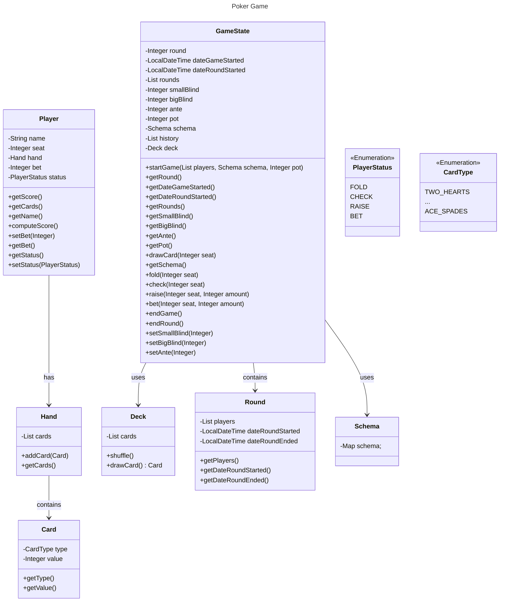

```mermaid
---
title: Poker Game
---
classDiagram

    class GameState {
        -Integer round
        -LocalDateTime dateGameStarted
        -LocalDateTime dateRoundStarted
        -List<Round> rounds
        -Integer smallBlind
        -Integer bigBlind
        -Integer ante
        -Integer pot
        -Schema schema
        -List<GameState> history
        -Deck deck

        +startGame(List<String> players, Schema schema, Integer pot)
        +getRound()
        +getDateGameStarted()
        +getDateRoundStarted()
        +getRounds()
        +getSmallBlind()
        +getBigBlind()
        +getAnte()
        +getPot()
        +drawCard(Integer seat)
        +getSchema()
        +fold(Integer seat)
        +check(Integer seat)
        +raise(Integer seat, Integer amount)
        +bet(Integer seat, Integer amount)
        +endGame()
        +endRound()
        +setSmallBlind(Integer)
        +setBigBlind(Integer)
        +setAnte(Integer)
    }

    class Deck {
        -List<Card> cards

        +shuffle()
        +drawCard() Card
    }

    class Hand {
        -List<Card> cards

        +addCard(Card)
        +getCards()
    }

    class Round {
        -List<Player> players
        -LocalDateTime dateRoundStarted
        -LocalDateTime dateRoundEnded

        +getPlayers()
        +getDateRoundStarted()
        +getDateRoundEnded()
    }

    class Schema {
        -Map<Integer, Integer> schema;
    }

    class Player {
        -String name
        -Integer seat
        -Hand hand
        -Integer bet
        -PlayerStatus status

        +getScore()
        +getCards()
        +getName()
        +computeScore()
        +setBet(Integer)
        +getBet()
        +getStatus()
        +setStatus(PlayerStatus)
    }

    class PlayerStatus {
        <<Enumeration>>
        FOLD
        CHECK
        RAISE
        BET
    }

    class Card {
        -CardType type
        -Integer value

        +getType()
        +getValue()
    }

    class CardType {
        <<Enumeration>>
        TWO_HEARTS
        ...
        ACE_SPADES
    }

    GameState --> Deck : uses
    GameState --> Round : contains
    GameState --> Schema : uses
    Player --> Hand : has
    Hand --> Card : contains

```
