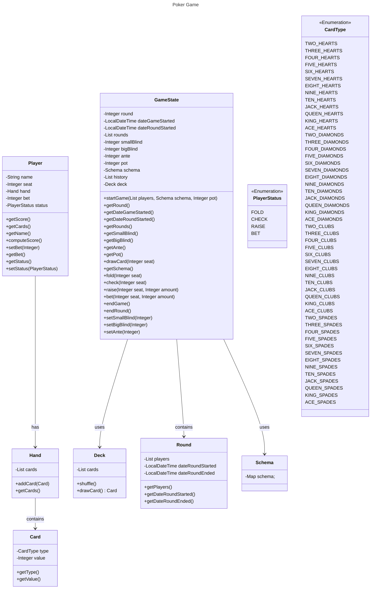

# Class diagram

```mermaid
---
title: Poker Game
---
classDiagram

    class GameState {
        -Integer round
        -LocalDateTime dateGameStarted
        -LocalDateTime dateRoundStarted
        -List<Round> rounds
        -Integer smallBlind
        -Integer bigBlind
        -Integer ante
        -Integer pot
        -Schema schema
        -List<GameState> history
        -Deck deck

        +startGame(List<String> players, Schema schema, Integer pot)
        +getRound()
        +getDateGameStarted()
        +getDateRoundStarted()
        +getRounds()
        +getSmallBlind()
        +getBigBlind()
        +getAnte()
        +getPot()
        +drawCard(Integer seat)
        +getSchema()
        +fold(Integer seat)
        +check(Integer seat)
        +raise(Integer seat, Integer amount)
        +bet(Integer seat, Integer amount)
        +endGame()
        +endRound()
        +setSmallBlind(Integer)
        +setBigBlind(Integer)
        +setAnte(Integer)
    }

    class Deck {
        -List<Card> cards

        +shuffle()
        +drawCard() Card
    }

    class Hand {
        -List<Card> cards

        +addCard(Card)
        +getCards()
    }

    class Round {
        -List<Player> players
        -LocalDateTime dateRoundStarted
        -LocalDateTime dateRoundEnded

        +getPlayers()
        +getDateRoundStarted()
        +getDateRoundEnded()
    }

    class Schema {
        -Map<Integer, Integer> schema;
    }

    class Player {
        -String name
        -Integer seat
        -Hand hand
        -Integer bet
        -PlayerStatus status

        +getScore()
        +getCards()
        +getName()
        +computeScore()
        +setBet(Integer)
        +getBet()
        +getStatus()
        +setStatus(PlayerStatus)
    }

    class PlayerStatus {
        <<Enumeration>>
        FOLD
        CHECK
        RAISE
        BET
    }

    class Card {
        -CardType type
        -Integer value

        +getType()
        +getValue()
    }

    class CardType {
        <<Enumeration>>
        TWO_HEARTS
        THREE_HEARTS
        FOUR_HEARTS
        FIVE_HEARTS
        SIX_HEARTS
        SEVEN_HEARTS
        EIGHT_HEARTS
        NINE_HEARTS
        TEN_HEARTS
        JACK_HEARTS
        QUEEN_HEARTS
        KING_HEARTS
        ACE_HEARTS

        TWO_DIAMONDS
        THREE_DIAMONDS
        FOUR_DIAMONDS
        FIVE_DIAMONDS
        SIX_DIAMONDS
        SEVEN_DIAMONDS
        EIGHT_DIAMONDS
        NINE_DIAMONDS
        TEN_DIAMONDS
        JACK_DIAMONDS
        QUEEN_DIAMONDS
        KING_DIAMONDS
        ACE_DIAMONDS

        TWO_CLUBS
        THREE_CLUBS
        FOUR_CLUBS
        FIVE_CLUBS
        SIX_CLUBS
        SEVEN_CLUBS
        EIGHT_CLUBS
        NINE_CLUBS
        TEN_CLUBS
        JACK_CLUBS
        QUEEN_CLUBS
        KING_CLUBS
        ACE_CLUBS

        TWO_SPADES
        THREE_SPADES
        FOUR_SPADES
        FIVE_SPADES
        SIX_SPADES
        SEVEN_SPADES
        EIGHT_SPADES
        NINE_SPADES
        TEN_SPADES
        JACK_SPADES
        QUEEN_SPADES
        KING_SPADES
        ACE_SPADES
    }

    GameState --> Deck : uses
    GameState --> Round : contains
    GameState --> Schema : uses
    Player --> Hand : has
    Hand --> Card : contains

```
